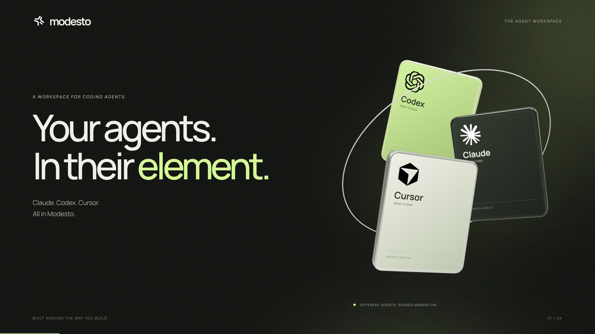

<p align="center">
  
</p>

<h1 align="center">Modesto</h1>

<p align="center">
  <b>Your agents. Chat and Work. One local desk.</b><br />
  <b>1.0.0 Aloha — Alpha Release Candidate</b>
</p>

<p align="center">
  
  
  
  
  
</p>

<p align="center">
  <a href="#download">Download</a> ·
  <a href="#whats-in-aloha">What's in Aloha</a> ·
  <a href="#features">Features</a> ·
  <a href="#quick-start">From source</a> ·
  <a href="https://github.com/Syphon1205/Modesto/releases/tag/v1.0.0-alpha.1">Release</a>
</p>

<br />

Hey — this is **Aloha**. That's the nickname for **1.0.0-alpha.1**, the first **Alpha Release Candidate** on the 1.0 line. Not a finished 1.0. Not a quiet docs-only drop. It's the desk: **Chat** and **Work**, plus PRs, Agents, Tasks, Automations, Connections, Music, Canvas, the whole right panel.

Codex, Claude, Cursor, Gemini, Grok, Meta Muse Code, and friends stay the CLIs you already pay for. Modesto just puts them in one place. Built by **Tanner Davidson** and whoever showed up.

<p align="center">
  
</p>

<table>
<tr>
<td width="50%">
  
</td>
<td width="50%">
  
</td>
</tr>
</table>

<br />

## Download

Grab **Aloha** from [the GitHub release](https://github.com/Syphon1205/Modesto/releases/tag/v1.0.0-alpha.1) (this is GitHub Latest).

| You | File |
| --- | --- |
| Mac (Apple Silicon) | [Modesto-1.0.0-alpha.1-arm64.dmg](https://github.com/Syphon1205/Modesto/releases/download/v1.0.0-alpha.1/Modesto-1.0.0-alpha.1-arm64.dmg) |
| Windows | [Modesto-1.0.0-alpha.1-x64.exe](https://github.com/Syphon1205/Modesto/releases/download/v1.0.0-alpha.1/Modesto-1.0.0-alpha.1-x64.exe) |
| Linux | [Modesto-1.0.0-alpha.1-x86_64.AppImage](https://github.com/Syphon1205/Modesto/releases/download/v1.0.0-alpha.1/Modesto-1.0.0-alpha.1-x86_64.AppImage) |

Checksums: [SHA256SUMS.txt](https://github.com/Syphon1205/Modesto/releases/download/v1.0.0-alpha.1/SHA256SUMS.txt). Intel Mac isn't in this drop yet. It's an alpha RC — Gatekeeper / SmartScreen might side-eye you. That's expected.

## What's in Aloha

**1.0.0-alpha.1 · Alpha Release Candidate.** Chat and Work are the headline. Everything else is the rest of the desk.

**Chat / Work** — flip it in the composer. Chat can fire with no folder open. Work is the repo job: branch, worktree, diffs, terminal, PRs.

**Also in the room** — Pull Requests, Agents, Tasks (Draft / In Progress / Done), Automations, Connections (Figma, Framer, Slack, Linear, Adobe, MCP…), Skills & plugins. Right panel: Browser, Mobile Simulator, Terminal, Files, Changes, Music, Canvas, Artifacts. Local / WSL / SSH. Pop-out chat. Usage clock.

**Default agents** — Codex, Claude, Cursor, Gemini, Grok, Meta Muse Code, Kilo. Switch mid-thread. They keep the context.

It's a candidate. Reconnects can still get weird. Some Work flows are still landing. Report it, don't whisper about it.

More: [Aloha notes](docs/releases/v1.0.0-alpha.1.md).

<details>
<summary><b>Earlier releases</b></summary>
<br />

**v0.3.0 — Early Modesto**

- **Honest versioning** — this is a new Modesto early release, not production 1.0.
- **Code and Work** — coding workspace plus an early cowork surface (Connections, sessions, browser/artifacts); Work is still evolving.
- **Work shell & chat reliability** — shared Code-style sidebar, Connections as its own tab, Temporary no longer wipes chats after send, hung sends surface recoverable errors.

**v0.1.9 — Provider Install**

- **In-app CLI install** for Poolside, Kimi, and Qwen — detect, verify,
  authenticate, repair, update, and remove each provider from Provider Tools.
- **Health-gated success** — a provider only counts as installed once Modesto
  finds the executable and a version or health probe passes.
- **CLI-validated composer picker** — ready providers first, then providers
  needing login, then Add provider; installed CLIs are the single source of truth.

**v0.1.8 — Shared Context**

- **Portable context bundles** assemble files, sessions, checkpoints, Git
  changes, sources, terminal activity, and unfinished tasks for handoff.
- **Resumable checkpoints** you can compare, resume, restore, and hand to
  another provider with the important context attached.
- **Workspace timeline** collects starts, edits, searches, tests, checkpoints,
  handoffs, and commits in one project view.
- **Teams as shared work** — assignments, reviews, shared runs, and subagent
  participants replace a chat-shaped room.

**v0.1.7 — Palo Alto**

- **Declared checkpoints** capture the working-tree diff, skipped checks,
  incomplete work, and the next action without duplicating unchanged seams.
- **Cross-provider handoffs** carry the project, branch, Git state, latest
  checkpoint, and next step between Claude, Codex, Cursor, and OpenCode.
- **Active window context** attaches a screenshot, app/window names, and
  accessibility text when the OS exposes it.

**v0.1.4 — San Leandro**

- **Composer bubbles** for Changes, Commit, Working, tasks, Plan mode, and
  Multi-agent — compact pills that only appear when needed.
- **Durable agent checkpoints** on provider handoffs, with Inspect / Rollback.
- **Claude agents end-to-end** plus Cloud Agents for enabled providers.

</details>

## Features

<table>
<tr>
<td width="50%" valign="top">

**Chat and Work**
Composer **Chat** for conversation (including no folder). Composer **Work** for repo threads with worktrees, diffs, and PRs.

**Every agent, one picker**
Codex, Claude, Cursor, Gemini, Grok, Meta Muse Code, Kilo, and more — discovered at runtime, switchable mid-thread with context.

**Pull Requests, Tasks, Automations**
Review inbox, Kanban Draft / In Progress / Done, scheduled runs and webhooks.

**Agents and skills**
Durable agent identities, `SKILL.md` packs, Claude plugins.

</td>
<td width="50%" valign="top">

**Connections**
Figma, Framer, Slack, Linear, GitHub, Adobe apps, MCP servers — signed-in web and native tools beside the thread.

**Right panel**
Browser, Mobile Simulator, Terminal, Files, Changes, Music, Canvas, Artifacts.

**Desktop environments**
Local, WSL, SSH. Pop-out chat. Usage clock. Appshots.

**Isolated sessions**
Each Work thread can take its own Git worktree and terminal so agents do not collide.

</td>
</tr>
</table>

## Workspaces

| Mode | What it's for |
| ---- | ------------- |
| **Chat** | Conversation-first threads. Start and send with no project. History under **Chats**. |
| **Work** | Ship software — project, branch, worktree, terminal, diffs, approvals, commits, PRs. |

Connections, Music, Canvas, Artifacts, and Browser are available beside the thread so cowork does not require leaving the desk.

## Platform support

The core product is a React web application served by a TypeScript/Bun server over WebSocket RPC. Electron supplies the native desktop shell for macOS, Windows, and Linux. The 1.0.0-alpha.1 RC matrix is Apple Silicon and Intel DMGs, a Windows installer, and a Linux AppImage — **signed publication of that matrix is still pending**. macOS-specific SwiftUI/AppKit enhancements are planned for lifecycle, menus, settings, pickers, notifications, window restoration, deep links, and system integrations — the main workspace stays web-based.

The Windows build supports WSL2 for Linux-backed projects, commands, provider
CLIs, development, and tests. See the
[WSL2 setup guide](CONTRIBUTING.md#windows-subsystem-for-linux-wsl2).

## Quick start

Requirements: **Bun 1.3.9+**, **Node.js 24.13.1+**, and a locally installed coding provider for live agent sessions.

```sh
bun install
bun run dev
```

<table>
<tr><th align="left">Command</th><th align="left">What it does</th></tr>
<tr><td><code>bun run modesto:dev</code></td><td>Start the desktop product (Electron)</td></tr>
<tr><td><code>bun run dev:server</code></td><td>Run the server only</td></tr>
<tr><td><code>bun run dev:web</code></td><td>Run the web app only</td></tr>
</table>

Modesto uses `~/.modesto` by default. Existing `~/.modesto` state and Electron application-support profiles are copied once when Modesto has no state of its own — legacy data is never deleted. `MODESTO_HOME` is the canonical environment variable, with `SYNARA_HOME` kept as a compatibility alias during migration.

<details>
<summary><b>Build and verification</b></summary>
<br />

```sh
bun run build
bun run build:desktop
bun run test
```

Desktop artifacts use the `Modesto-<version>-<arch>` name. See [docs/release.md](docs/release.md) for signing, packaging, update metadata, and smoke checks.

</details>

<details>
<summary><b>Project structure</b></summary>
<br />

| Path                 | Owns                                                                                                     |
| -------------------- | -------------------------------------------------------------------------------------------------------- |
| `apps/web`           | React/Vite application, workspaces, session UX, timeline, terminal, diffs, and previews                  |
| `apps/server`        | Bun/Node WebSocket server, provider orchestration, persistence, providers, Git, terminals, and worktrees |
| `apps/desktop`       | Electron lifecycle, native menus, windows, notifications, file dialogs, updater, and browser integration |
| `packages/contracts` | Schema-only shared contracts                                                                             |
| `packages/shared`    | Explicitly exported runtime utilities shared by server and web                                           |

The architecture is documented in [ARCHITECTURE.md](ARCHITECTURE.md).

</details>

## Roadmap

1. Keep hardening Modesto Code — performance, reliability, and predictable recovery through restarts and partial streams.
2. Grow Teams' live session board — richer status, easier multi-session review, smoother handoffs between providers.
3. Grow Research — structured citations, source tracking, and better evidence rendering in the transcript.
4. Add selective native macOS integrations around the web workspace.

## Contributing & attribution

See [CONTRIBUTING.md](CONTRIBUTING.md), [ACKNOWLEDGEMENTS.md](ACKNOWLEDGEMENTS.md), and [THIRD_PARTY_NOTICES.md](THIRD_PARTY_NOTICES.md).

Modesto preserves the license and copyright notices of the open-source work on which it depends and from which it evolved.

## License

See [LICENSE](LICENSE) — AGPL-3.0. Copyright © 2026 Tanner Davidson. Modesto was MIT through v0.3.x; it moved to AGPL-3.0 with the Bible Strong avatar engine. See [THIRD_PARTY_NOTICES.md](THIRD_PARTY_NOTICES.md).

<br />

<p align="center">
  <sub>Built by Tanner Davidson and contributors.</sub>
</p>
