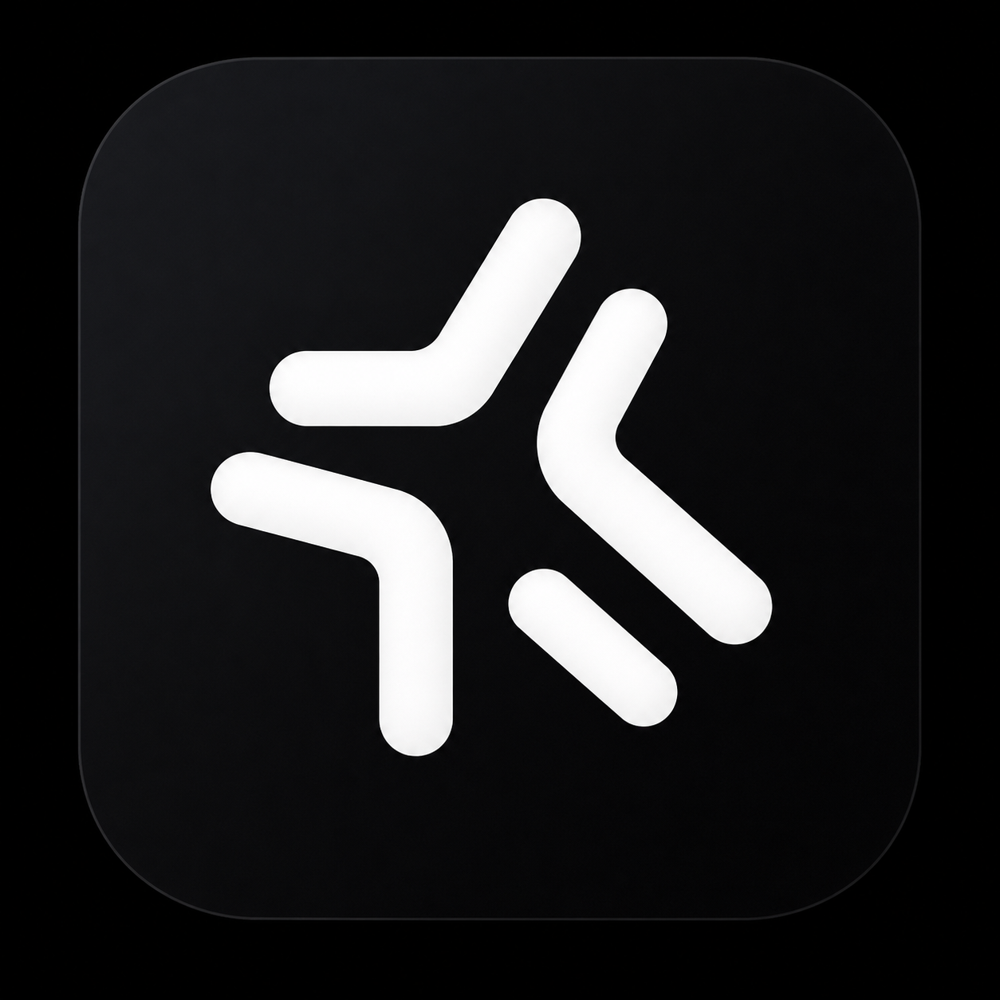

<p align="center">
  
</p>

<h1 align="center">Modesto</h1>

<p align="center">
  <b>One calm desktop workspace for every coding agent you use.</b>
</p>

<p align="center">
  
  
  
  
  
</p>

<p align="center">
  <a href="#features">Features</a> ·
  <a href="#download">Download</a> ·
  <a href="#whats-new-in-v0171">What's new</a> ·
  <a href="#workspaces">Workspaces</a> ·
  <a href="#quick-start">Quick start</a> ·
  <a href="#roadmap">Roadmap</a> ·
  <a href="#contributing--attribution">Contributing</a>
</p>

<br />

Modesto puts Codex, Claude Code, Cursor Agent, Gemini CLI, Grok, Factory Droid, Kilo Code, OpenCode, Pi, and other compatible agent providers in one workspace — so switching agents is a picker, not a reinstall. Built by **Tanner Davidson**.

<br />

## Download v0.1.4

**v0.1.4 — San Leandro is the current stable release.**

| Platform              | Download                                                                                                   |
| --------------------- | ---------------------------------------------------------------------------------------------------------- |
| macOS — Apple Silicon | [Download `.dmg`](https://github.com/Syphon1205/Modesto/releases/download/v0.1.4/Modesto-0.1.4-arm64.dmg)  |
| macOS — Intel         | [Download `.dmg`](https://github.com/Syphon1205/Modesto/releases/download/v0.1.4/Modesto-0.1.4-x64.dmg)    |
| Windows — x64         | [Download installer](https://github.com/Syphon1205/Modesto/releases/download/v0.1.4/Modesto-0.1.4-x64.exe) |

The macOS builds are Developer ID signed and notarized by Apple. Existing release
installations receive v0.1.4 through Modesto's built-in updater. See the
[full release and changelog](https://github.com/Syphon1205/Modesto/releases/tag/v0.1.4)
for every artifact.

## What's new in v0.1.7.1

- **Teams shared rooms** surface live runs, participants, attention states,
  and a filterable project timeline for checkpoints, handoffs, reviews, and diffs.
- **Safer chat controls** remove the agent-selection surfaces that could crash
  the composer while preserving existing agent activity in conversation history.
- **Four-part patch releases** keep Palo Alto fixes together under versions
  such as `0.1.7.1` without sacrificing updater ordering.

## Previously in v0.1.7

- **Declared checkpoints** capture the working-tree diff, checks not run,
  incomplete work, and the next action without duplicating unchanged seams.
- **Cross-provider handoffs** carry the project, branch, Git state, latest
  checkpoint, and next step between Claude, Codex, Cursor, and OpenCode.
- **Active window context** attaches a screenshot, app and window names, and
  accessibility text when the operating system makes it available.
- **Teams project spaces** bring people, agents, and a shared work timeline
  together. n8n configuration now lives under Automations.
- **Recovery hardening** improves restart reconciliation, stale Git refreshes,
  provider failure copy, and retry paths.

## Previously in v0.1.4

- **Composer bubbles** for Changes, Commit, Working, tasks, Plan mode, and
  Multi-agent — compact pills above the chat that only show when needed.
- **Durable agent checkpoints** on provider handoffs, with Inspect / Rollback
  from the seam card.
- **Claude agents end-to-end** plus Cloud Agents limited to enabled providers.
- Builds on **Fremont (v0.1.3)** handoff seams, Cursor-parity settings, and
  structured continue / return flows.

## Features

<table>
<tr>
<td width="50%" valign="top">

**Multi-provider by design**
Provider availability is discovered at runtime — nothing is hardcoded, so new agents show up automatically.

**Parallel, isolated sessions**
Every thread gets its own Git worktree, terminal, and conversation timeline, so agents never step on each other.

**Agent handoffs with context**
Switch a thread from one provider to another mid-task — the new agent inherits the conversation, worktree, and branch instead of starting cold.

**Rich conversation surfaces**
Tool calls, file changes, diffs, browser previews, approvals, and Git actions render inline, not as a wall of logs.

</td>
<td width="50%" valign="top">

**Teams**
Hand off a whole outcome and track every session across every provider — what it's doing right now, and how far along it is.

**Research**
A workspace tuned for investigation — agents cite sources and bring back evidence, and the thread keeps the receipts.

**Kanban tasks**
Drag threads across Draft / In Progress / Done, with live status instead of a static list.

**Automations & Model Routers**
Schedule a prompt on a cadence, or point Codex at any OpenAI-compatible endpoint — local or hosted — and it just shows up in the model picker.

</td>
</tr>
</table>

## Workspaces

| Workspace    | What it's for                                                                                                                                              |
| ------------ | ---------------------------------------------------------------------------------------------------------------------------------------------------------- |
| **Code**     | Build, debug, and ship — projects, persistent sessions, parallel work, isolated worktrees, terminals, diffs, browser previews, approvals, and Git actions. |
| **Teams**    | Hand off a complete outcome to an agent and watch it work, with a live board of every session in flight.                                                   |
| **Research** | Investigate and bring back evidence — purpose-built quick starts and a feed of what's been found.                                                          |

All three share the same sidebar, thread view, and composer — only the landing surface changes per workspace.

## Platform support

The core product is a React web application served by a TypeScript/Bun server over WebSocket RPC. Electron currently supplies the native desktop shell for macOS, Windows, and Linux. macOS-specific SwiftUI/AppKit enhancements are planned for lifecycle, menus, settings, pickers, notifications, window restoration, deep links, and system integrations — the main workspace stays web-based.

The v0.1.4 Windows build supports WSL2 for Linux-backed projects, commands, provider
CLIs, development, and tests. See the
[WSL2 setup guide](CONTRIBUTING.md#windows-subsystem-for-linux-wsl2). Native Windows
installer creation and signing remain Windows-host tasks.

## Quick start

Requirements: **Bun 1.3.9+**, **Node.js 24.13.1+**, and a locally installed coding provider for live agent sessions.

```sh
bun install
bun run dev
```

<table>
<tr><th align="left">Command</th><th align="left">What it does</th></tr>
<tr><td><code>bun run modesto:dev</code></td><td>Start the desktop product (Electron)</td></tr>
<tr><td><code>bun run dev:server</code></td><td>Run the server only</td></tr>
<tr><td><code>bun run dev:web</code></td><td>Run the web app only</td></tr>
</table>

Modesto uses `~/.modesto` by default. Existing `~/.modesto` state and Electron application-support profiles are copied once when Modesto has no state of its own — legacy data is never deleted. `MODESTO_HOME` is the canonical environment variable, with `SYNARA_HOME` kept as a compatibility alias during migration.

<details>
<summary><b>Build and verification</b></summary>
<br />

```sh
bun run build
bun run build:desktop
bun run build:marketing
bun run test
```

Desktop artifacts use the `Modesto-<version>-<arch>` name. See [docs/release.md](docs/release.md) for signing, packaging, update metadata, and smoke checks.

</details>

<details>
<summary><b>Project structure</b></summary>
<br />

| Path                 | Owns                                                                                                     |
| -------------------- | -------------------------------------------------------------------------------------------------------- |
| `apps/web`           | React/Vite application, workspaces, session UX, timeline, terminal, diffs, and previews                  |
| `apps/server`        | Bun/Node WebSocket server, provider orchestration, persistence, providers, Git, terminals, and worktrees |
| `apps/desktop`       | Electron lifecycle, native menus, windows, notifications, file dialogs, updater, and browser integration |
| `apps/marketing`     | Public website and release download surface                                                              |
| `packages/contracts` | Schema-only shared contracts                                                                             |
| `packages/shared`    | Explicitly exported runtime utilities shared by server and web                                           |

The architecture is documented in [ARCHITECTURE.md](ARCHITECTURE.md).

</details>

## How we used Codex and GPT-5.6

Modesto was developed during OpenAI Build Week using Codex and GPT-5.6 as core parts of the development process.

### Codex

Codex was used throughout development to:

- Explore and understand the existing Modesto codebase
- Plan and implement new application features
- Debug Swift and SwiftUI issues
- Refactor parts of the application architecture
- Connect interface components to working project state
- Investigate runtime and provider integrations
- Review code changes before they were accepted
- Accelerate iteration during the limited Build Week timeline

Codex worked directly alongside the project repository, allowing development tasks to remain grounded in the actual codebase rather than isolated code snippets.

### GPT-5.6

GPT-5.6 was used to:

- Define and refine the overall Modesto product direction
- Design workflows for coding agents, research, automations, and collaboration
- Reason through the multi-provider architecture
- Plan the desktop-to-mobile companion experience
- Develop the code review and agent handoff concepts
- Identify usability problems in early interface iterations
- Create structured implementation plans and development prompts
- Prepare project documentation and submission materials

GPT-5.6 helped transform Modesto from a basic AI coding interface into a broader coordination layer for developers, coding agents, models, and runtimes.

### Other development tools

Claude was also used during development for selected implementation and codebase tasks. Modesto is intentionally provider independent, and the development process reflected that approach by using different agents where they were most effective.

All tools were directed, reviewed, and integrated by the project's individual developer.

## Roadmap

1. Keep hardening Modesto Code — performance, reliability, and predictable recovery through restarts and partial streams.
2. Grow Teams' live session board — richer status, easier multi-session review, smoother handoffs between providers.
3. Grow Research — structured citations, source tracking, and better evidence rendering in the transcript.
4. Add selective native macOS integrations around the web workspace.

## Contributing & attribution

See [CONTRIBUTING.md](CONTRIBUTING.md), [ACKNOWLEDGEMENTS.md](ACKNOWLEDGEMENTS.md), and [THIRD_PARTY_NOTICES.md](THIRD_PARTY_NOTICES.md).

Modesto preserves the license and copyright notices of the open-source work on which it depends and from which it evolved.

## License

See [LICENSE](LICENSE) — Proprietary. Copyright © 2026 Tanner Davidson. All rights reserved.

<br />

<p align="center">
  <sub>Built by Tanner Davidson.</sub>
</p>
