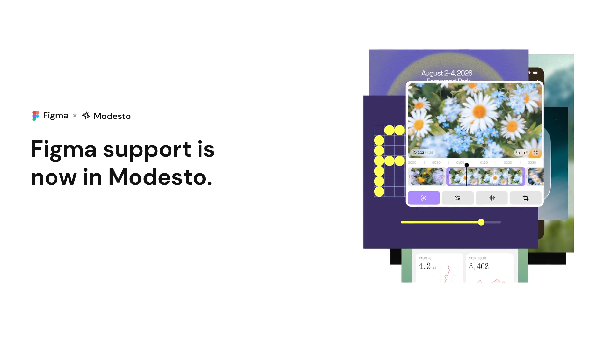
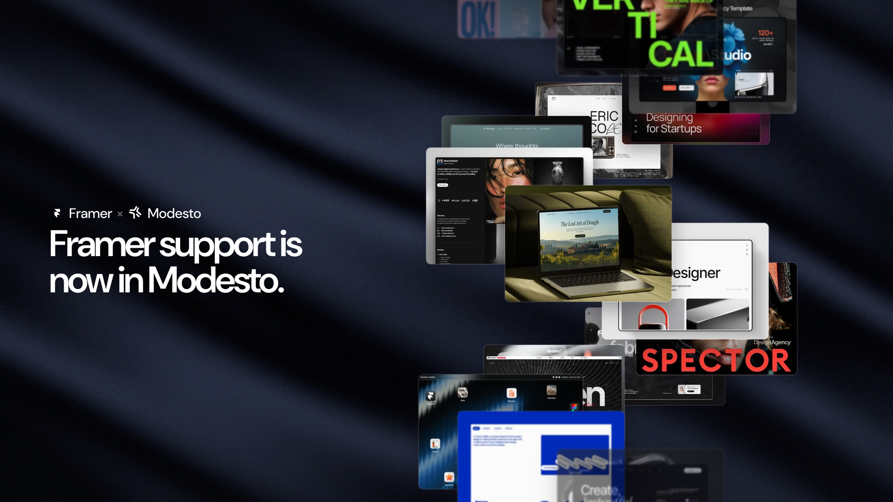

<p align="center">
  
</p>

<h1 align="center">Modesto</h1>

<p align="center">
  <b>The open-source control plane for coding agents — local-first, multi-provider, now on the 1.0 alpha line.</b>
</p>

<p align="center">
  
  
  
  
  
</p>

<p align="center">
  <a href="#download">Download</a> ·
  <a href="#whats-new">What's new</a> ·
  <a href="#features">Features</a> ·
  <a href="#workspaces">Workspaces</a> ·
  <a href="#quick-start">Quick start</a> ·
  <a href="#roadmap">Roadmap</a> ·
  <a href="#contributing--attribution">Contributing</a>
</p>

<br />

Modesto puts Codex, Claude Code, Cursor Agent, Gemini CLI, Grok, Meta (Muse Code), Factory Droid, Kilo Code, OpenCode, Pi, and other compatible agent providers in one local-first desktop — Code for shipping software, Work for local cowork tasks. Built by **Tanner Davidson** and contributors. This line is **1.0.0-alpha.1**: more stable and feature-rich than the 0.3/0.4 GitHub builds, still an alpha, not a finished 1.0 product.

<p align="center">
  <a href="apps/marketing/public/announcements/modesto-saas-16x9.mp4">
    
  </a>
</p>

<p align="center">
  <em>Your agents. In their element. — Figma and Framer live in Connections beside the same thread.</em>
</p>

<table>
<tr>
<td width="50%">
  
</td>
<td width="50%">
  
</td>
</tr>
</table>

<br />

## Download

**v1.0.0-alpha.1 — release candidate.** The source is available here. New signed
installers are pending native validation and signing credentials; existing apps
remain on the previous published release until the signed release is published.

Get existing downloads from [GitHub Releases](https://github.com/Syphon1205/Modesto/releases/latest).
The candidate build matrix targets Apple Silicon and Intel macOS DMGs, a Windows
x64 installer, and a Linux x64 AppImage. Windows package metadata uses **Modesto Team**.
See [release status and notes](docs/releases/v1.0.0-alpha.1.md).


macOS builds are Developer ID signed and notarized by Apple. Installed copies
update themselves through Modesto's built-in updater — you only download once.
The [latest release](https://github.com/Syphon1205/Modesto/releases/latest)
always lists every artifact and changelog.

## What's new

### v1.0.0-alpha.1 — release candidate

- **Hop from 0.3 and 0.4** — this is GitHub Latest, so older GitHub desktop builds update themselves.
- **More of the product** — chats without a project, desktop environments, header usage clock, Grok as a first-class provider.
- **Still an alpha** — useful and evolving; not a claim that every surface is finished.
- **Web connections** — Figma and Framer sit in the same workspace as the thread, browser, and diffs.

### v0.4.0 — New Foundation

- **Open source under MIT** — public on GitHub, local-first, zero telemetry, complete ownership.
- **New core** — typed RPC and Effect-TS services throughout for a more durable client-server foundation.
- **Code + Work** — agent sessions, tasks, connections, diffs, and artifacts in one platform.
- **Cross-provider handoff** — switch providers mid-conversation with prior context replayed into a fresh session.
- **Tasks, automations, and plugins** — Kanban board, scheduled prompts, and Claude Code plugin installs on the new core.

<details>
<summary><b>Earlier releases</b></summary>
<br />

**v0.3.0 — Early Modesto**

- **Honest versioning** — this is a new Modesto early release, not production 1.0.
- **Code and Work** — coding workspace plus an early cowork surface (Connections, sessions, browser/artifacts); Work is still evolving.
- **Work shell & chat reliability** — shared Code-style sidebar, Connections as its own tab, Temporary no longer wipes chats after send, hung sends surface recoverable errors.

**v0.1.9 — Provider Install**

- **In-app CLI install** for Poolside, Kimi, and Qwen — detect, verify,
  authenticate, repair, update, and remove each provider from Provider Tools.
- **Health-gated success** — a provider only counts as installed once Modesto
  finds the executable and a version or health probe passes.
- **CLI-validated composer picker** — ready providers first, then providers
  needing login, then Add provider; installed CLIs are the single source of truth.

**v0.1.8 — Shared Context**

- **Portable context bundles** assemble files, sessions, checkpoints, Git
  changes, sources, terminal activity, and unfinished tasks for handoff.
- **Resumable checkpoints** you can compare, resume, restore, and hand to
  another provider with the important context attached.
- **Workspace timeline** collects starts, edits, searches, tests, checkpoints,
  handoffs, and commits in one project view.
- **Teams as shared work** — assignments, reviews, shared runs, and subagent
  participants replace a chat-shaped room.

**v0.1.7 — Palo Alto**

- **Declared checkpoints** capture the working-tree diff, skipped checks,
  incomplete work, and the next action without duplicating unchanged seams.
- **Cross-provider handoffs** carry the project, branch, Git state, latest
  checkpoint, and next step between Claude, Codex, Cursor, and OpenCode.
- **Active window context** attaches a screenshot, app/window names, and
  accessibility text when the OS exposes it.

**v0.1.4 — San Leandro**

- **Composer bubbles** for Changes, Commit, Working, tasks, Plan mode, and
  Multi-agent — compact pills that only appear when needed.
- **Durable agent checkpoints** on provider handoffs, with Inspect / Rollback.
- **Claude agents end-to-end** plus Cloud Agents for enabled providers.

</details>

## Features

<table>
<tr>
<td width="50%" valign="top">

**Multi-provider by design**
Provider availability is discovered at runtime — nothing is hardcoded, so new agents show up automatically.

**Parallel, isolated sessions**
Every thread gets its own Git worktree, terminal, and conversation timeline, so agents never step on each other.

**Agent handoffs with context**
Switch a thread from one provider to another mid-task — the new agent inherits the conversation, worktree, and branch instead of starting cold.

**Rich conversation surfaces**
Tool calls, file changes, diffs, browser previews, approvals, and Git actions render inline, not as a wall of logs.

</td>
<td width="50%" valign="top">

**Work & the web**
Early cowork for investigation and local tasks — Connections (Figma, Framer, signed-in web apps), sessions, browser/artifacts. Still evolving.

**Kanban tasks**
Drag threads across Draft / In Progress / Done, with live status instead of a static list.

**Automations & Model Routers**
Schedule a prompt on a cadence, or point Codex at any OpenAI-compatible endpoint — local or hosted — and it just shows up in the model picker.

</td>
</tr>
</table>

## Workspaces

| Workspace | What it's for                                                                                                                                              |
| --------- | ---------------------------------------------------------------------------------------------------------------------------------------------------------- |
| **Code**  | Build, debug, and ship — projects, persistent sessions, parallel work, isolated worktrees, terminals, diffs, browser previews, approvals, and Git actions. |
| **Work**  | Early local cowork — drafts, research, Connections, sessions, browser/artifacts. Still evolving; not a finished 1.0 surface.                               |

Code and Work share the same sidebar patterns and thread/composer chrome — only the job of each workspace changes.

## Platform support

The core product is a React web application served by a TypeScript/Bun server over WebSocket RPC. Electron supplies the native desktop shell for macOS, Windows, and Linux, and ships signed macOS `.dmg`s, a Windows installer, and a Linux `.AppImage`. macOS-specific SwiftUI/AppKit enhancements are planned for lifecycle, menus, settings, pickers, notifications, window restoration, deep links, and system integrations — the main workspace stays web-based.

The Windows build supports WSL2 for Linux-backed projects, commands, provider
CLIs, development, and tests. See the
[WSL2 setup guide](CONTRIBUTING.md#windows-subsystem-for-linux-wsl2).

## Quick start

Requirements: **Bun 1.3.9+**, **Node.js 24.13.1+**, and a locally installed coding provider for live agent sessions.

```sh
bun install
bun run dev
```

<table>
<tr><th align="left">Command</th><th align="left">What it does</th></tr>
<tr><td><code>bun run modesto:dev</code></td><td>Start the desktop product (Electron)</td></tr>
<tr><td><code>bun run dev:server</code></td><td>Run the server only</td></tr>
<tr><td><code>bun run dev:web</code></td><td>Run the web app only</td></tr>
</table>

Modesto uses `~/.modesto` by default. Existing `~/.modesto` state and Electron application-support profiles are copied once when Modesto has no state of its own — legacy data is never deleted. `MODESTO_HOME` is the canonical environment variable, with `SYNARA_HOME` kept as a compatibility alias during migration.

<details>
<summary><b>Build and verification</b></summary>
<br />

```sh
bun run build
bun run build:desktop
bun run build:marketing
bun run test
```

Desktop artifacts use the `Modesto-<version>-<arch>` name. See [docs/release.md](docs/release.md) for signing, packaging, update metadata, and smoke checks.

</details>

<details>
<summary><b>Project structure</b></summary>
<br />

| Path                 | Owns                                                                                                     |
| -------------------- | -------------------------------------------------------------------------------------------------------- |
| `apps/web`           | React/Vite application, workspaces, session UX, timeline, terminal, diffs, and previews                  |
| `apps/server`        | Bun/Node WebSocket server, provider orchestration, persistence, providers, Git, terminals, and worktrees |
| `apps/desktop`       | Electron lifecycle, native menus, windows, notifications, file dialogs, updater, and browser integration |
| `apps/marketing`     | Public website and release download surface                                                              |
| `packages/contracts` | Schema-only shared contracts                                                                             |
| `packages/shared`    | Explicitly exported runtime utilities shared by server and web                                           |

The architecture is documented in [ARCHITECTURE.md](ARCHITECTURE.md).

</details>

## Roadmap

1. Keep hardening Modesto Code — performance, reliability, and predictable recovery through restarts and partial streams.
2. Grow Teams' live session board — richer status, easier multi-session review, smoother handoffs between providers.
3. Grow Research — structured citations, source tracking, and better evidence rendering in the transcript.
4. Add selective native macOS integrations around the web workspace.

## Contributing & attribution

See [CONTRIBUTING.md](CONTRIBUTING.md), [ACKNOWLEDGEMENTS.md](ACKNOWLEDGEMENTS.md), and [THIRD_PARTY_NOTICES.md](THIRD_PARTY_NOTICES.md).

Modesto preserves the license and copyright notices of the open-source work on which it depends and from which it evolved.

## License

See [LICENSE](LICENSE) — AGPL-3.0. Copyright © 2026 Modesto was MIT through v0.3.x; it moved to AGPL-3.0 with the Bible Strong avatar engine. See [THIRD_PARTY_NOTICES.md](THIRD_PARTY_NOTICES.md).

<br />

<p align="center">
  <sub>Built by Tanner Davidson and contributors.</sub>
</p>
