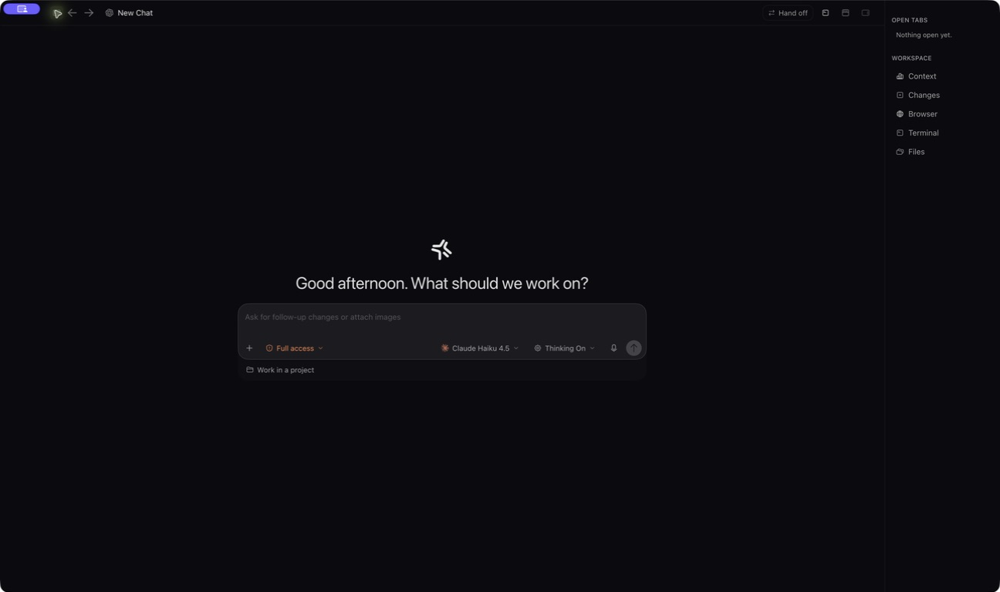

<div align="center">
  

  <h1>Modesto</h1>

  <p><strong>One focused workspace for your coding agents.</strong></p>
  <p>
    Plan, execute, review, and hand off work across Codex, Claude, Cursor,
    Gemini, Grok, and more—without losing the thread.
  </p>

  <p>
    <a href="https://github.com/Syphon1205/Modesto/releases/latest"><strong>Download v0.2.0</strong></a>
    &nbsp;·&nbsp;
    <a href="#command-line-interface">Install the CLI</a>
    &nbsp;·&nbsp;
    <a href="https://github.com/Syphon1205/Modesto/releases">All releases</a>
  </p>

  <p>
    
    
    
    <a href="https://www.npmjs.com/package/@modestocode/cli"></a>
  </p>
</div>

<p align="center">
  
</p>

## One place for the whole task

Modesto brings the conversation, project files, terminal, browser, diffs,
screenshots, and provider tools into one desktop workspace. Pick the right
agent for the job, follow its work live, and review the outcome with the context
that produced it.

| Plan with intent | Execute with confidence | Review in context |
| --- | --- | --- |
| Choose Agent or Plan for the next turn. | Work with multiple providers from one task. | Keep diffs, browser previews, app shots, and output beside the conversation. |

## Download Modesto

| Platform | Requirements | Download |
| --- | --- | --- |
| **macOS · Apple Silicon** | macOS 12+ · M1 or newer | [Download DMG](https://github.com/Syphon1205/Modesto/releases/download/v0.2.0/Modesto-0.2.0-arm64.dmg) |
| **macOS · Intel** | macOS 12+ · Intel processor | [Download DMG](https://github.com/Syphon1205/Modesto/releases/download/v0.2.0/Modesto-0.2.0-x64.dmg) |
| **Windows · x64** | Windows 10 or 11 | [Download EXE](https://github.com/Syphon1205/Modesto/releases/download/v0.2.0/Modesto-0.2.0-x64.exe) |
| **Linux · x64** | Ubuntu 22.04+ or equivalent | [Download AppImage](https://github.com/Syphon1205/Modesto/releases/download/v0.2.0/Modesto-0.2.0-x64.AppImage) |

Every stable release also includes updater metadata, so Modesto can discover
future updates from inside the app.

> Download Modesto only from this repository’s
> [Releases](https://github.com/Syphon1205/Modesto/releases) page.

## Command-Line Interface

<p>
  <a href="https://www.npmjs.com/package/@modestocode/cli"></a>
  
</p>

Prefer a terminal over a desktop window? `modesto` is the same workspace as a
CLI—same providers, same projects, same conversations, just rendered as text.

```bash
npm install -g @modestocode/cli
```

Then just run it:

```bash
modesto
```

That drops you straight into the full-screen terminal UI: a live session list,
a composer, `/` for slash commands, `ctrl+p` for the command palette, and
`ctrl+g` for help. A couple of other entry points if you want them:

| Command | What it does |
| --- | --- |
| `modesto` | Launches the full-screen terminal UI. |
| `modesto chat` | A lighter, single-pane chat client—same engine, simpler UI. |
| `modesto serve` | Runs Modesto as a local HTTP/WebSocket server (what the desktop app uses under the hood). |

The CLI shares the same projects, threads, and provider connections as the
desktop app—start a task in one, pick it back up in the other.

<details>
<summary><strong>Requirements</strong></summary>

The full-screen `tui` mode renders through a native terminal graphics layer
that currently requires [Bun](https://bun.sh). If you're running under plain
Node, `modesto` will automatically relaunch itself under Bun when it's
installed, or point you to `modesto chat`/`modesto serve` as a fallback if it
isn't.

</details>

## Get started

1. Download the installer for your computer, or install the CLI above.
2. Install and open Modesto (or run `modesto`).
3. Choose a provider and sign in to your own account when prompted.
4. Open a project and start a task.

Modesto prepares bundled provider launchers in its private application data on
first launch. Later launches reuse that installation and refresh it only when
the bundled runtime changes.

<details>
<summary><strong>First-launch security notices</strong></summary>

macOS and Windows desktop builds are code-signed; macOS builds are also
notarized by Apple, so they should open without a Gatekeeper warning. If you
ever see one anyway, confirm the download came from this repository's
[Releases](https://github.com/Syphon1205/Modesto/releases) page before
continuing.

</details>

## About this repository

This is the official public distribution home for Modesto desktop binaries,
release notes, and issue tracking. Application source code is not published
here.

For security reports, see the [Security policy](SECURITY.md). For bugs and
focused feedback, see [Contributing](CONTRIBUTING.md).

---

<div align="center">
  <sub>
    Built by Tanner Davidson. Modesto is an independent desktop application.
    Provider names and trademarks belong to their respective owners.
  </sub>
</div>
